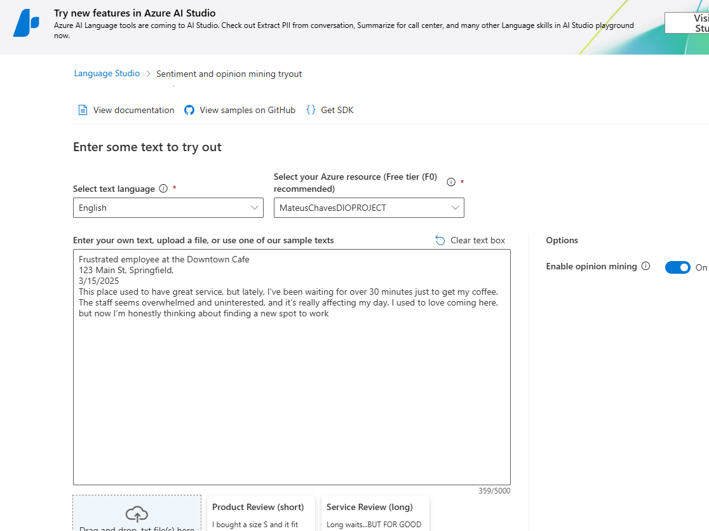
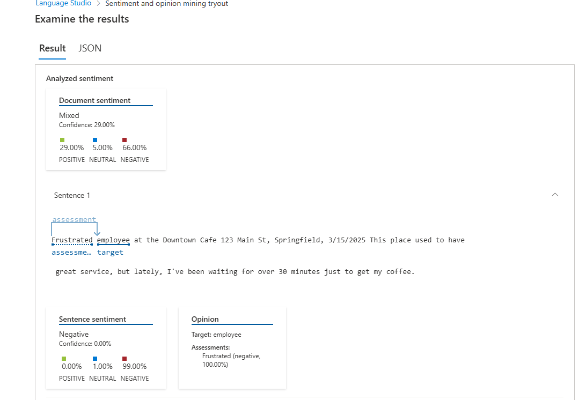
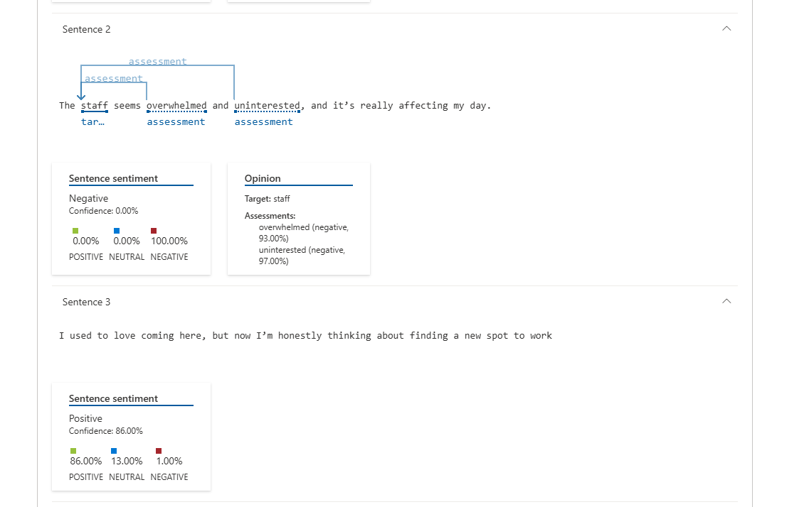
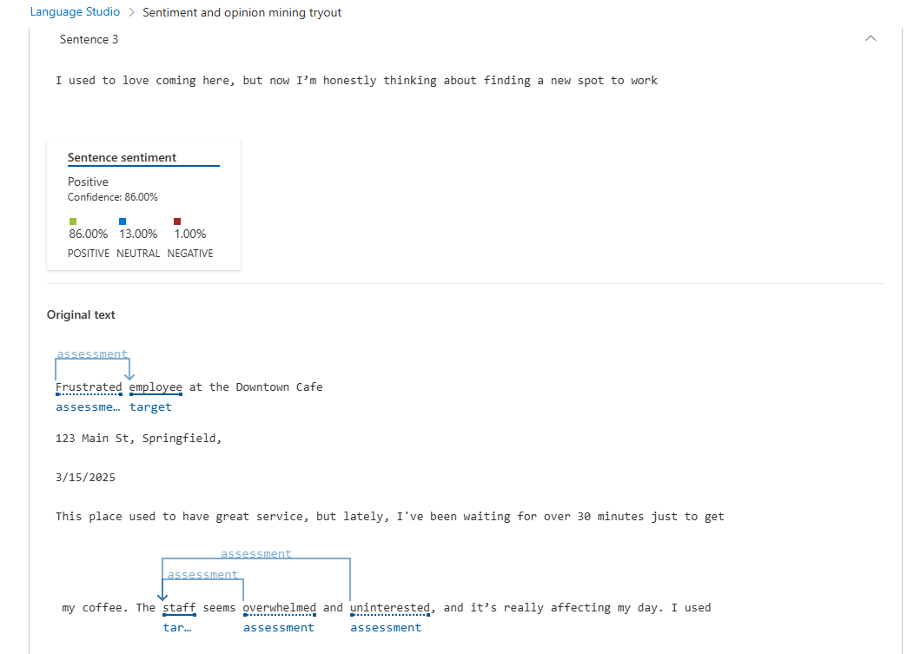

# 🤖 Analisando Texto com IA do Azure

## 🔍 Visão Geral
Este projeto explora os serviços de IA do Azure para análise de texto, incluindo extração de frases-chave, detecção de idioma e análise de sentimento. O objetivo é entender como essas ferramentas podem ser aplicadas para obter insights de documentos.

## 🔧 Tecnologias Utilizadas
- **Microsoft Azure Cognitive Services** (Linguagem de IA)
- **Language Studio** para testes sem código
- **Git/GitHub** para versionamento do código

## 📂 Estrutura do Projeto
```
/analisando-texto-ia-azure
│── inputs/
│   ├── sentences.txt   # Arquivo de entrada com frases para análise
│── README.md          # Documentação do projeto
```
### 📃 Prints do Processo




## 🌟 Resultados e Insights
- O processo foi meio complexo na criação da conta da azure e depois a configuração para poder utilizar a IA, pois
acabou ocorrendo vários erros na assinatura, mas consegui depois de algumas alterações.
- Achei a utilização da ferramenta excelente para pessoas que possuem lojas e produtos, essa detecção de sentimentos é uma
forte ferramenta para conseguirem juntar dados e melhorar seus produtos, com um processo totalmente automatizado.
- Acredito que um produto com uma breve evolução para detectar emoções através de imagens, é um passo além para infinitas possibilidades.

## 💪 Como Contribuir
1. Fork este repositório
2. Clone para sua máquina `git clone https://github.com/seu-usuario/analisando-texto-ia.git`
3. Adicione novas análises e envie um PR!

## 🌟 Link do Repositório
[**GitHub - analisando-texto-ia**](https://github.com/seu-usuario/analisando-texto-ia)

---

